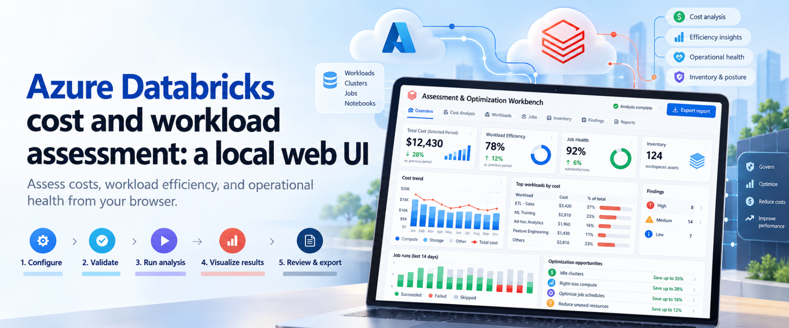

# Azure Databricks Cost Optimization

A collection of tools, automation, and workshop assets for assessing and improving Azure Databricks cost efficiency. The repository combines a read-only assessment pipeline, a local visualization UI, and reproducible Azure workshop infrastructure.

## Highlights

- **Read-only cost assessment** collects Azure and Databricks evidence without modifying resources or intentionally starting stopped compute.
- **Deterministic analysis and reporting** normalizes collected data, reconciles costs, identifies optimization opportunities, and produces review-ready Markdown, JSON, and CSV outputs.
- **Guided local UI** supports Configure → Validate → Run analysis → Visualize results → Review & export, including saved assessment snapshots and offline evidence review.
- **Reproducible workshop environment** provisions a guarded Azure Databricks lab with Bicep, PowerShell, sample workloads, cost controls, validation, and safe teardown.
- **Human validation gates** keep recommendations advisory and distinguish incomplete evidence, delayed telemetry, and modeled savings from realized savings.

## Repository layout

| Path | Purpose |
| --- | --- |
| [`assessment/`](assessment/) | Read-only PowerShell collectors, Python analysis pipeline, detector catalog, reports, tests, and operator guidance. |
| [`ui/`](ui/) | React/Vite assessment UI and loopback-only Python host for local orchestration and visualization. |
| [`infra/`](infra/) | Bicep modules, Databricks configuration, sample workloads, deployment scripts, and infrastructure tests for the L300 workshop. |
| [`docs/`](docs/) | Requirements, specifications, design material, and supporting documentation. |
| [`blog/`](blog/) | Walkthrough content and media for the assessment experience. |

## How the assessment works

1. Define or interactively select the approved Azure and Databricks scope.
2. Validate authentication, permissions, configuration, and read-only readiness.
3. Collect raw evidence into a unique, customer-controlled run folder.
4. Normalize and reconcile supported Azure and Databricks datasets.
5. Run conservative detectors and generate prioritized findings.
6. Review, validate, and export recommendations before implementing any change.

Assessment findings are advisory. A partial run, unavailable source, or pending telemetry must not be interpreted as zero usage or zero cost.

## Prerequisites

The exact requirements depend on the component being used:

- PowerShell 7
- Python 3
- Azure CLI authenticated to the intended tenant and subscription
- Network access to Azure Resource Manager and the selected Databricks workspaces
- Least-privilege Azure and Databricks permissions for the approved scope
- Node.js and npm only when rebuilding or testing the UI
- Pester 5+ for PowerShell tests
- Checkov for infrastructure security validation

See the component guides for detailed permission and environment requirements.

## Quick start

### Run the assessment

From the repository root:

```powershell
.\assessment\Invoke-Assessment.ps1
```

To interactively select subscriptions, resource groups, and Databricks workspaces:

```powershell
.\assessment\Invoke-Assessment.ps1 -SelectScope
```

For configuration, automation, offline analysis, output semantics, and troubleshooting, see the [assessment README](assessment/README.md) and [user guide](assessment/USER-GUIDE.md).

### Launch the local UI

```powershell
.\ui\Start-AssessmentUi.ps1
```

The launcher starts a loopback-only host at `http://127.0.0.1:8765`. The UI uses the existing assessment engine; it does not duplicate collection or analysis logic. See the [UI README](ui/README.md) for build, test, mock-mode, and operational details.

The [local web UI walkthrough](blog/azure-databricks-assessment-optimization-workbench.md) covers cost, workload efficiency, and job health through the five-step workflow.

### Provision the workshop environment

The infrastructure scripts target a dedicated, billable workshop environment. Start with a validation and what-if preview:

```powershell
az account show --output table
az bicep build --file .\infra\main.bicep
checkov -d .\infra --config-file .\infra\.checkov.yml
Invoke-Pester -Path .\infra\tests
.\infra\scripts\Deploy-WorkshopEnvironment.ps1
```

Preview does not authorize deployment. Deployment requires the explicit `-Deploy` and `-AcknowledgeCostRisk` switches. Review the [infrastructure README](infra/README.md) before creating or removing resources.

## Validation

Run the smallest suite for the component you change.

### Assessment

```powershell
Invoke-Pester -Path .\assessment\tests -PassThru -Output Normal
python -m unittest -v `
  assessment.tests.test_assessment_contracts `
  assessment.tests.model.test_model_pipeline `
  assessment.tests.reports.test_reports
.\assessment\scripts\Test-AssessmentReadOnly.ps1 -Path .\assessment
```

### UI

```powershell
Set-Location .\ui
npm ci
npm run typecheck
npm test
npm run build
python -m unittest discover -s server -p "test_*.py"
```

### Infrastructure

```powershell
az bicep build --file .\infra\main.bicep
checkov -d .\infra --config-file .\infra\.checkov.yml
Invoke-Pester -Path .\infra\tests
```

## Safety and cost boundaries

- Review the selected tenant, subscription, resource groups, workspaces, and cost scope before every run.
- Collection is designed to be read-only; SQL Warehouse auto-start requires explicit approval.
- Protect assessment outputs as customer data and sanitize evidence before sharing.
- Do not claim realized savings from list prices, synthetic runs, incomplete evidence, or incomparable time windows.
- Workshop deployment creates billable resources and must be preceded by validation and review of the Azure what-if output.
- Use the guarded teardown workflow in the infrastructure guide; do not delete shared or pre-existing environments.

## Documentation

- [Assessment toolkit](assessment/README.md)
- [Assessment user guide](assessment/USER-GUIDE.md)
- [UI operations and development](ui/README.md)
- [Workshop infrastructure](infra/README.md)
- [End-to-end specification](docs/AzureDatabricksCostOptimizationEndToEndSpecification.md)
- [Assessment toolkit requirements](docs/AzureDatabricksAssessmentToolkitRequirements.md)
- [Workshop requirements](docs/L300AzureDatabricksCostOptimizationWorkshopRequirements.md)
