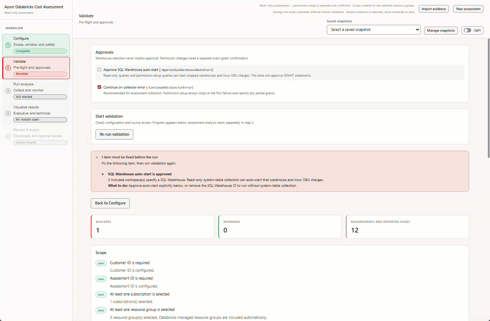
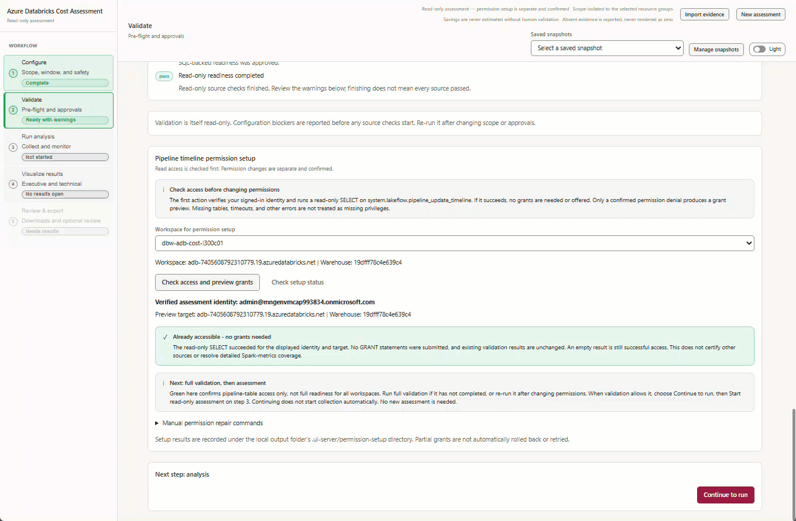
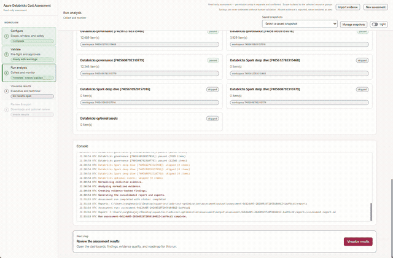
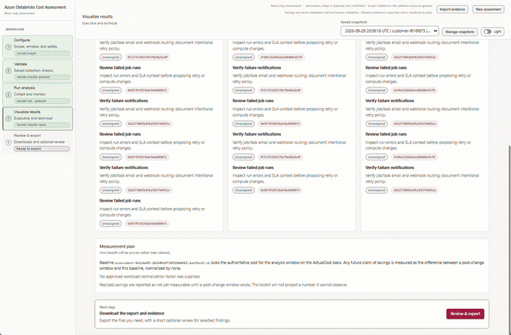
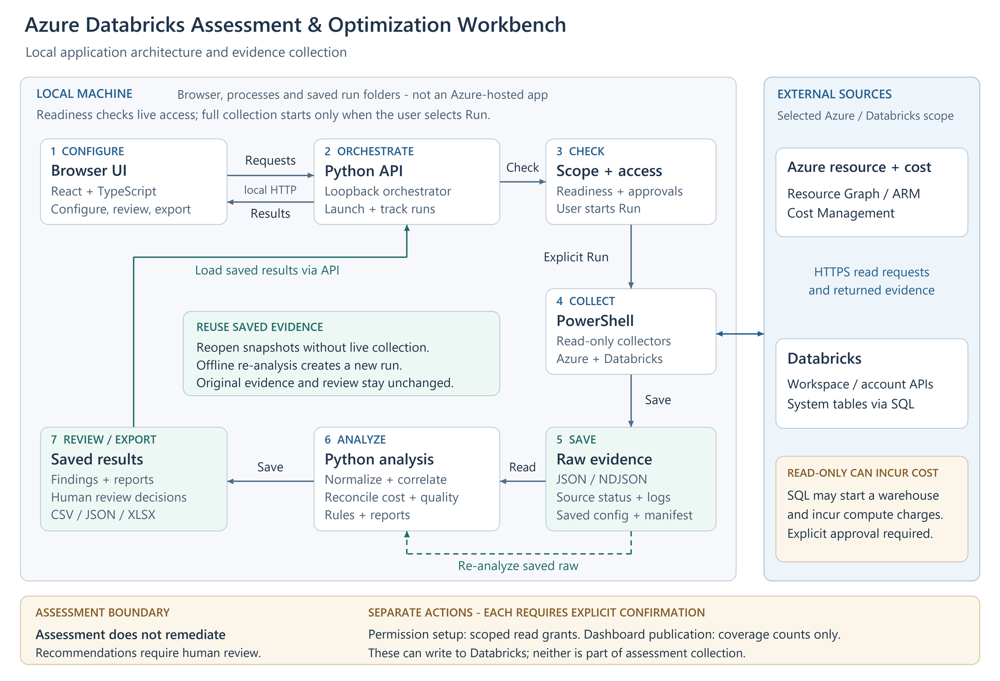

# Azure Databricks cost and workload assessment: a local web UI

> **TL;DR:** A local web-based UI for assessing Azure Databricks costs, workload efficiency, and operational health. Run it on your machine, open it in your browser, collect evidence from selected workspaces, and export findings for human review. No application deployment to Azure is required.
> 
> **Who this is for:** Azure architects, data engineers, financial operations (FinOps) practitioners, and Databricks platform owners.

## Introduction

To review an Azure Databricks environment, you need to know what it costs, how its compute is used, and which jobs need attention. That information is spread across Azure billing and Databricks.

The [Assessment & Optimization Workbench](https://github.com/jvargh/adb-cost-optimization) is a local web application that brings these details together. Select your workspaces and dates, check access, and run an assessment. You can then explore the results in your browser and download a report to discuss with your team. The walkthrough below shows each step.

**Contents**

1.  [What you can assess](#1-what-you-can-assess)
2.  [The five-step workflow](#2-the-five-step-workflow)
3.  [Reopen saved assessments](#3-reopen-saved-assessments)
4.  [Architecture and collection flow](#4-architecture-and-collection-flow)
5.  [Get started](#5-get-started)

## 1\. What you can assess

The assessment covers costs, workload behavior, and selected configuration checks:

| Area | What you can inspect |
| --- | --- |
| **Cost** | Actual and Amortized costs, top drivers, attribution gaps, and commitment scenarios with eligible hourly inputs. |
| **Efficiency** | CPU/memory samples, idle observations, sizing candidates, query duration, and queueing. |
| **Job health** | Failures, retries, failure notifications, and network observations. |
| **Inventory and posture** | Workspace assets, IP access list settings, and Unity Catalog metastore assignment. |
| **Evidence** | Collection coverage, snapshots, raw-data imports, and offline re-analysis. |
| **Handoff** | Prioritized findings, optional review decisions, formatted reports, and Excel exports. |

If some data could not be collected, the UI shows what is missing. Recommendations are suggestions for you to review and test; the assessment does not apply them automatically. Actual savings must be measured after you make a change.

## 2\. The five-step workflow

The UI guides you from choosing what to assess to downloading a report. First, select your workspaces and check access. Then start the assessment, explore the results, and export what you need. The walkthrough below shows each step.

**Configure → Validate → Run analysis → Visualize results → Review & export**

### Configure

This step defines what the assessment will cover: which workspaces to review, the date range, and the data to collect. These choices prepare the assessment; they do not start collection.


The GIF shows the scope selection, warehouse choices, and date settings before moving to validation.

*   **Select the scope:** choose the subscriptions, resource groups, and Databricks workspaces to include.
*   **Set the dates and cost basis:** choose the period to assess. **ActualCost** shows charges as recorded; **AmortizedCost** spreads eligible commitment costs over time.
*   **Choose the collection profile:** use **Standard** for core assessment data, **Extended** to include workspace asset metadata, or **Custom** to select optional data and analysis modules.
*   **Select SQL Warehouses:** choose a warehouse for each workspace that needs system-table queries. Selection does not start compute. Queries can incur charges, so warehouse use requires approval in Validate.

**Next:** Select **Validate configuration**.

### Validate

Validation checks your setup and access to the selected Azure and Databricks data. It helps you identify missing permissions or approvals before starting the assessment.



Select **Run validation**, approving warehouse auto-start if required. The UI shows which checks are running, which have passed, and what needs attention. The GIF shows an approval issue being resolved, followed by the access checks.

Fix any blockers that prevent the assessment from running, and read warnings about data that may be limited or unavailable. If permissions are missing, the permission panel provides commands for an authorized administrator to run. Validation itself does not grant access.

**Next:** Once validation allows you to proceed, select **Continue to run** below the permission panel. You will review the setup and start the assessment separately.

### Run analysis

This step collects data from your selected Azure and Databricks workspaces, analyzes it, and creates the assessment report. You can follow the progress and see which sources returned data.



Review the selected workspaces and date range, then select **Start read-only assessment**. The screen shows:

*   **Progress:** the current stage, from initial checks and collection through analysis and report generation, plus elapsed time.
*   **Collection sources:** cards grouped into Azure data and Databricks workspaces. Each card shows its status and the number of items collected, such as cost records, inventory, or billing data.
*   **Console:** detailed messages to help explain delays or collection problems.

When the run finishes, green means collection and analysis succeeded, not that every workload is healthy. Red means the run failed or some data needs attention. A skipped source was not collected, often because an optional check was not selected.

The report and collected data are saved locally, including any reported gaps.

**Next:** Select **Visualize results** to explore the saved assessment.

### Visualize results

This step turns the collected data into charts, tables, and findings you can explore. Start with the overall cost and collection summary, then look at individual workspaces, compute resources, and jobs to understand what needs attention. You are viewing saved results, so switching tabs does not collect data again.



The GIF follows the results from cost and workload details through findings, data quality, and a proposed roadmap. The tabs are grouped into **Overview**, **Technical**, and **Decisions**.

#### Overview: understand the cost

*   **Executive summary:** see total cost, spending mapped to workspaces, optimization candidates, and collection status. Check whether the detailed costs match the billing total and how much supporting data is available.
*   **Cost analysis:** use **Cost evidence** to compare Actual and Amortized trends. Break down spending by **Service**, **Meter category**, **SKU**, **Resource group**, **Workspace**, or **Owner tag**, then inspect the largest cost drivers and unmapped spend. **Commitment opportunities** lets you enter a proposed number of committed nodes and calculate a scenario when the required hourly usage and pricing data is available. It does not purchase a commitment.

#### Technical: inspect resources and workloads

*   **Compute and SQL** has five views:
    *   **Inventory:** cluster and warehouse settings, including node types, worker counts, Photon, and automatic shutdown, plus job run and failure summaries.
    *   **Utilization:** CPU, memory, idle observations, and sample counts. Select a resource and a driver or worker instance to view its CPU and memory chart.
    *   **Sizing:** current node and worker configuration, with candidates to benchmark before resizing.
    *   **Job health:** runs, failures, notification settings, tasks, and retry policies.
    *   **Network:** data sent and received by nodes, plus CPU-wait measurements. These are traffic observations, not billed network charges.
*   **Queries:** switch between **Individual queries**, **Warehouse summaries**, and **User summaries**. Review durations, queue times, and failures; search and sort to find queries that need investigation.
*   **Posture:** inspect IP access list settings and Unity Catalog metastore assignment. Each check shows its observed value and outcome; this is not a full security audit.
*   **Assets:** browse collected repositories, notebook metadata, MLflow experiments, serving endpoints, SQL alerts, Genie spaces, and Unity Catalog volumes. These appear only when the relevant optional data was collected.

#### Decisions: check findings and plan the next steps

*   **Findings:** browse recommendations by category, status, and confidence. Select a row to read what was observed, the recommended next step, supporting records, and any limitations.
*   **Evidence quality:** see coverage by workspace, missing data, failed or skipped sources, and records excluded from scope. Open **Inspect effective rules / create another analysis** to review or change analysis settings, then **Create child analysis** to rerun them on saved data without changing the original snapshot.
*   **Roadmap:** review proposed work across **Days 0-30**, **31-60**, and **61-90**, including owners and dependencies. The measurement plan explains the baseline for checking savings after a change; the roadmap is not an approved implementation schedule.

Use **Filters** to narrow findings by subscription, resource group, workspace, workload, category, confidence, or status. Scope selections also apply to supported technical tables, which have their own search, sorting, and paging controls. Select a resource name to inspect its saved details.

If data is unavailable, check **Evidence quality** before drawing a conclusion. A missing measurement does not mean that a resource was unused.

**Next:** Select **Review & export** to read the report or download the results.

### Review & export

This final step lets you read the assessment report and download files to discuss with your team. You can also record decisions on individual findings. Review is optional, so you do not need to approve every finding before exporting.



The GIF shows a finding being reviewed, the formatted report and supporting files being opened, and an Excel workbook being generated and downloaded.

*   **Read the report:** select **Preview report** to move directly to the formatted report in your browser. Use its contents links to jump to sections, and open supporting evidence links to inspect the saved files.
*   **Download the report:** select **Download report** to save the original Markdown version. Downloading a file completes this workflow step, but does not approve findings or apply changes.
*   **Record a decision:** expand **Record a decision**, choose a finding and decision, then enter the reviewer and an optional note. Select **Save review decisions** to retain the changes. A decision other than pending requires a reviewer.
*   **Inspect supporting files:** use **Run artifacts** to preview supported files or download individual outputs. Reports appear as formatted pages; CSV and JSON previews show the file contents as text.
*   **Create an Excel workbook:** choose the modules under **Excel workbook**, then select **Generate workbook artifact** and download the generated file. It includes summary, rules, quality, findings, saved review decisions, and the selected module sheets. It covers the full saved assessment, not just the rows currently filtered in the UI.

Save or discard pending review edits before generating a workbook. Exports include saved decisions only. Check the files before sharing them because supporting evidence can contain sensitive environment details.

**Optional dashboard publication** is a separate cloud action for publishing coverage counts, not the full assessment. It requires a destination workspace and warehouse, a preview of the publication plan, and explicit approval of the write and possible warehouse charges.

## 3\. Reopen saved assessments

A snapshot is a locally saved assessment, including the selected scope, collected data, findings, reports, and review decisions. It lets you return to earlier results, continue a review, or download files later without querying Azure or Databricks again.

*   **Reopen an assessment:** choose a run from **Saved snapshots**. Entries show the run date, customer, status, and run ID, with the newest first. You can then explore its results or continue in **Review & export**.
*   **Try different analysis settings:** open **Evidence quality**, expand **Inspect effective rules / create another analysis**, adjust the settings, and select **Create child analysis**. This creates a separate assessment using the same saved data. The original remains unchanged, and the new findings need their own review.
*   **Remove old assessments:** use **Manage snapshots** to delete individual snapshots or clear the saved history. Deletion requires confirmation and permanently removes the selected runs, including their evidence, reports, and review decisions. Back up important runs first.

Snapshots show what was collected at the time, not the current environment. To get newer data or collect a missing source, start a new assessment.

## 4\. Architecture and collection flow

The workbench runs on your machine, with a browser interface connected to a local Python server at `http://127.0.0.1:8765`. Azure and Databricks supply the data; collection scripts, analysis, and saved results stay local. No Azure-hosted application is needed.



The diagram follows an assessment through seven stages:

1.  **Configure:** the React and TypeScript browser UI captures your selected workspaces, dates, and collection options.
2.  **Coordinate:** the Python API receives requests from the browser, launches assessment processes, and tracks progress.
3.  **Check access:** validation checks the selected scope, permissions, and required approvals. These checks use live access, but full collection starts only when you select **Start read-only assessment**.
4.  **Collect:** PowerShell scripts read Azure resource inventory and billing data, plus Databricks APIs and system tables. Requests to these external sources use HTTPS.
5.  **Save evidence:** each run stores the returned data, configuration, source outcomes, and logs in a local folder.
6.  **Analyze:** Python combines the saved data, checks costs against billing totals, identifies data gaps, and applies rules to produce findings and reports.
7.  **Review and export:** the API returns saved results to the browser, where you explore findings, record decisions, and download reports or data files.

**Keep in mind:** the assessment does not apply recommendations. SQL Warehouse queries can incur charges, and exported files should be checked for sensitive details before sharing.

## 5\. Get started

### Try it

**Prerequisites:** PowerShell 7+, Python 3, Node.js 22.12+/npm for the build, and Azure CLI signed in. Collection needs Azure Reader/Cost Management Reader and the required Databricks source access.

From the repository root:

```
Set-Location .\ui
npm ci
npm run build
Set-Location ..
.\ui\Start-AssessmentUi.ps1
```

Open `http://127.0.0.1:8765` and keep the launcher running. If already built, only the final command is needed.

### Learn more

*   [User guide](https://github.com/jvargh/adb-cost-optimization/blob/main/ui/USER-GUIDE.md)
*   [Required permissions](https://github.com/jvargh/adb-cost-optimization/blob/main/assessment/docs/permissions-and-authentication.md)
*   [Test record and limitations](https://github.com/jvargh/adb-cost-optimization/blob/main/ui/docs/capabilities-test-plan.md)

### Contribute

Report issues in the [repository](https://github.com/jvargh/adb-cost-optimization) with reproduction steps and redacted source statuses. Never include credentials or raw customer evidence.

_Publishing check: redact environment identifiers in GIFs and upload media when posting outside the repository. Displayed timings and amounts are not benchmarks or savings claims._