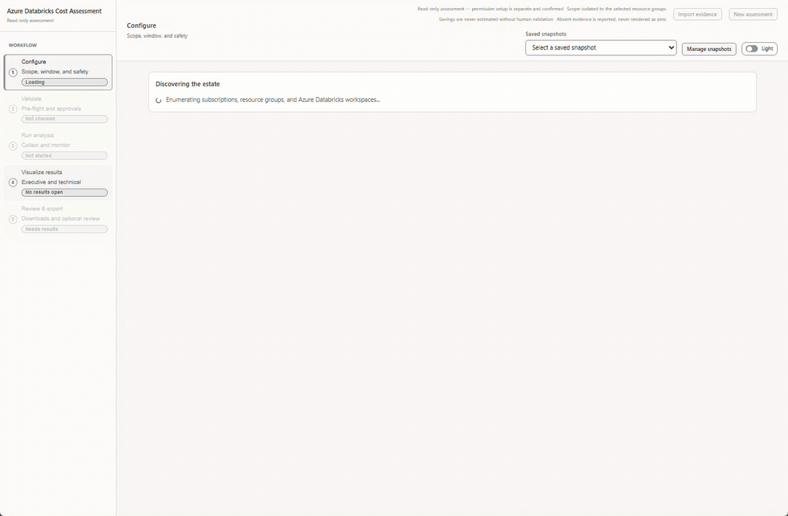
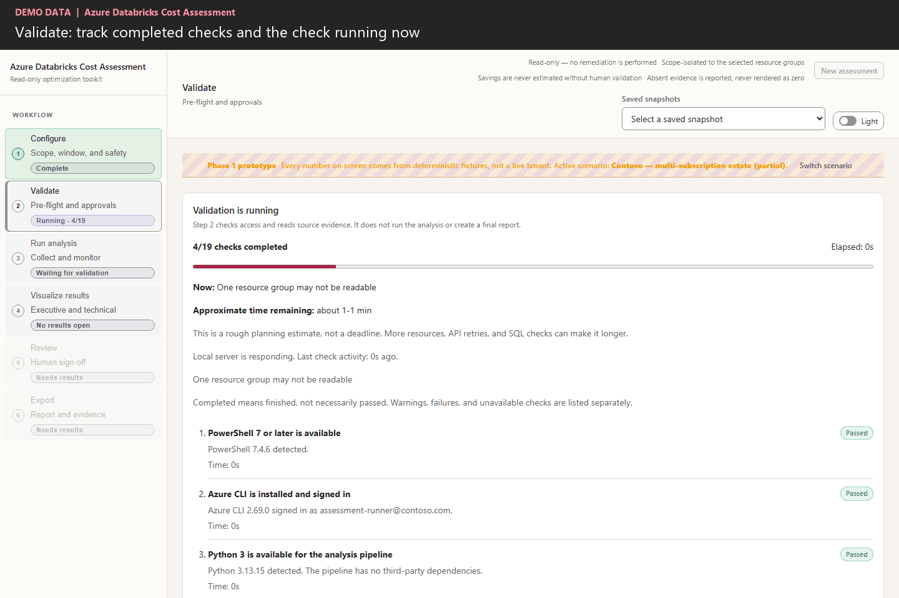
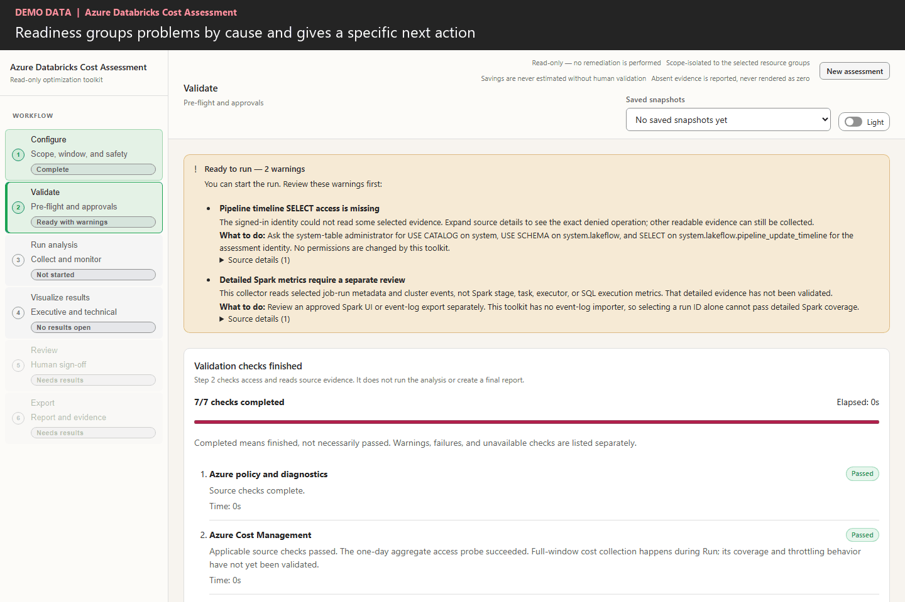
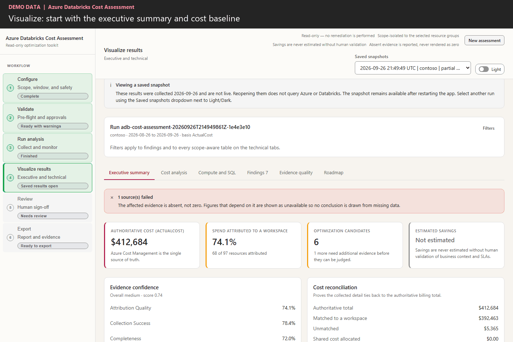
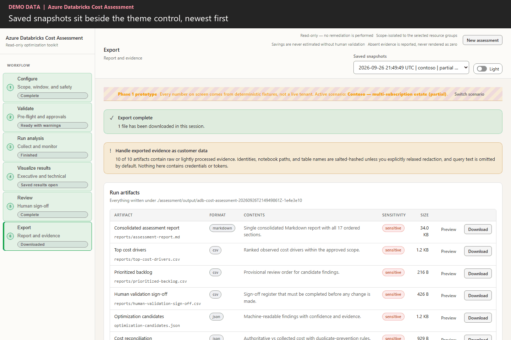
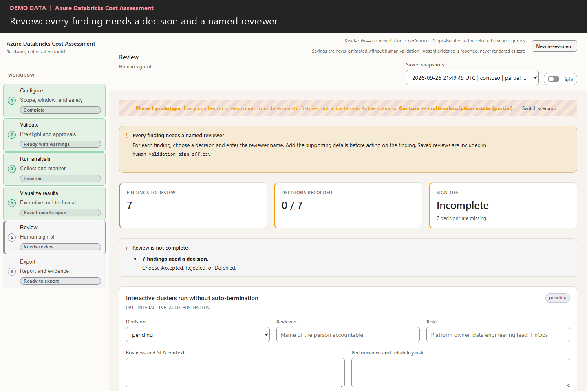
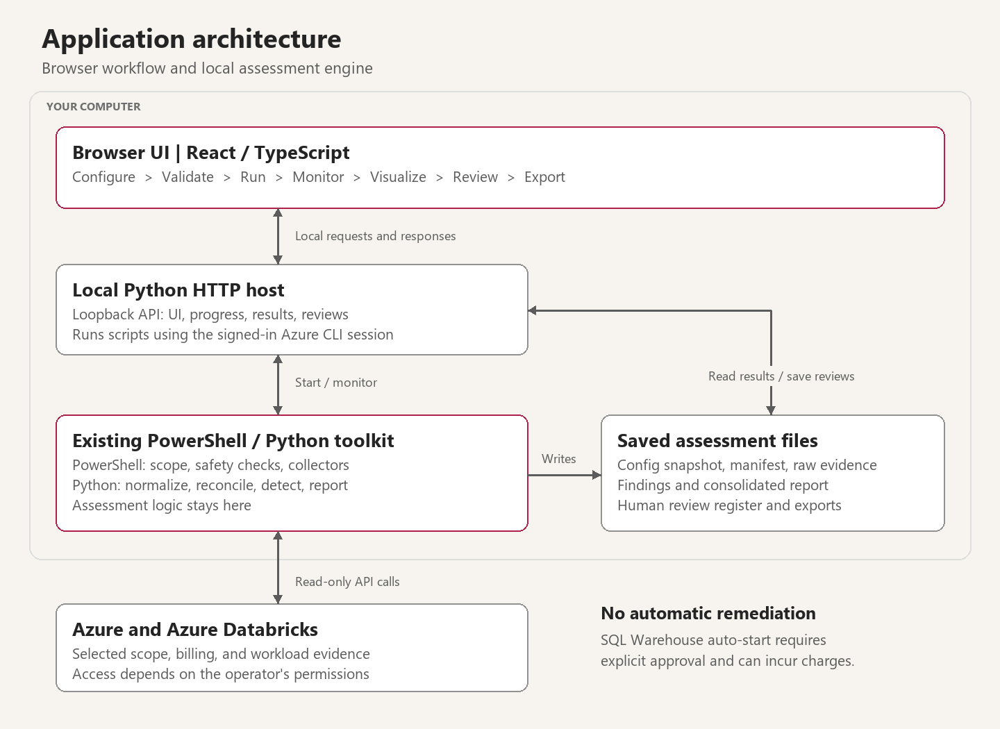
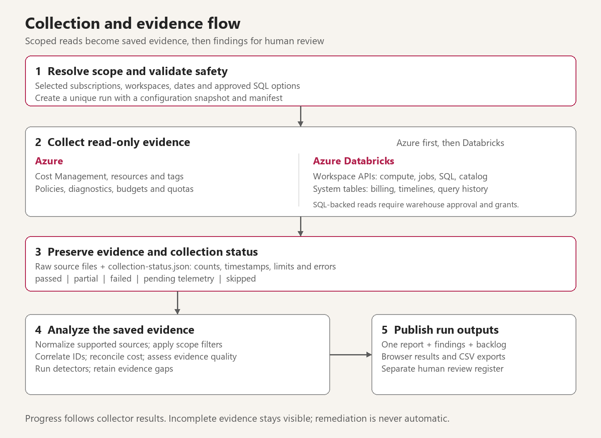

# Azure Databricks Cost Assessment Toolkit: evidence and decisions in one workflow

> **TL;DR:** The Azure Databricks Cost Assessment Toolkit brings Azure costs, Databricks workload evidence, and candidate optimizations into a saved, reviewable assessment. It fills the workflow gap between inspecting separate cost and usage views and agreeing which changes the evidence supports. Revealed here for the first time, its new browser interface builds on the existing PowerShell/Python engine: configure the scope, resolve readiness issues, collect once, then reopen the saved evidence to review findings and record decisions without repeating collection.
>
> **Who this is for:** Architects, data engineers, financial operations (FinOps) teams, and customers reviewing Azure Databricks costs.

**Contents**

1. [What this tool adds](#1-what-this-tool-adds)
2. [See the UI in action](#2-see-the-ui-in-action)
3. [Architecture](#3-architecture)
4. [Try it](#4-try-it)

## 1. What this tool adds

**This toolkit connects cost analysis to an evidence-backed review process.** A saved assessment brings together the selected Azure scope, Databricks workload metadata, collection limitations, candidate actions, and reviewer decisions.

Azure Cost Management, Databricks usage views, and system tables provide essential inputs. The gap addressed here is the work required to turn those inputs into a reviewable assessment: align scope and dates, inspect collection failures, connect findings to evidence, and preserve decisions. The existing scripts handled collection and analysis; the new UI connects execution and review without requiring participants to navigate commands and output folders.

- **Cost context with explicit boundaries.** Review Azure infrastructure costs alongside Databricks unit (DBU) usage, keep Actual and Amortized costs separate, and avoid adding underlying serverless compute charges twice. Unmatched costs remain visible rather than being forced onto a workload.
- **Findings with evidence and limitations.** Open a candidate, inspect its supporting observations, and see what could not be collected. Missing permissions or telemetry cannot silently become a healthy result or zero cost.
- **A recorded handoff.** Accept, reject, or defer findings with a named reviewer and rationale, then export the report, proposed backlog, and sign-off register.
- **Reusable snapshots.** Every completed run is saved locally. Reopen it from the timestamp-sorted dropdown instead of repeating API calls, or start a new assessment without deleting previous evidence.

The distinction is the connected assessment workflow, not a replacement for native cost tools or a claim of complete automated diagnosis. Production changes and validation of savings remain separate, human-controlled work.

## 2. See the UI in action

The complete journey is:

**Configure → Validate → Run → Monitor → Visualize → Review → Export**

The three main areas are **Configure**, **Run analysis**, and **Visualize results**. Validation and monitoring support execution; review and export complete the handoff.

**About the recordings:** These are actual UI interactions using fixture data, not live customer assessments. The readiness close-up uses local fixture responses through the production validation renderer; the other recordings use demo mode. Identifiers are masked, and the edited GIFs use short pauses for readability. Demo figures, findings, and timings are illustrative, not savings claims or performance benchmarks. Still images are linked below each animation.

### Configure



[Open the still image](assets/01-configure.png)

New assessments supply editable customer and assessment IDs plus the previous 30 complete Coordinated Universal Time (UTC) days. Select subscriptions, resource groups, and workspaces, then adjust the dates and choose ActualCost, AmortizedCost, or both. The effective-scope summary lets you check the selection before continuing.

The recording also shows the optional SQL (Structured Query Language) Warehouse selector, deep-dive targets, and controls for query text, identities, and notebook paths. A selected warehouse requires explicit auto-start approval during validation because even read-only queries can incur charges.

**Databricks account settings** lets you add the account ID and accounts hostname for account workspace and budget checks. These are optional, but omitting them leaves a visible coverage gap; entering them does not grant access. Numbered workflow steps turn from gray to green when their completion conditions are met, not simply when opened.

**Next:** Select **Validate configuration**. Choosing scope alone does not start the assessment.

### Run analysis



[Open the still image](assets/02-validate-run.png)

Validation first checks the configuration locally, so blank or invalid fields do not launch cloud calls. It then shows completed checks, the active source, elapsed time, and an approximate time remaining. Production readiness performs real source reads, so allow several minutes.



[Open the readiness still image](assets/06-readiness.png)

Warnings are grouped by cause rather than repeated for every affected workspace. Each group provides a specific next action and expandable source responses. For example, a denied pipeline timeline names `system.lakeflow.pipeline_update_timeline` and the required `SELECT` permission. Validation itself never changes permissions.

The separate **Pipeline timeline permission setup** action starts with **Check access and preview grants**. After explicit warehouse approval, it verifies the identity and runs a read-only SELECT. A successful query, even with zero rows, shows **Already accessible - no grants needed**. Only a permission denial offers the three grants for separate confirmation; missing tables and timeouts remain errors to investigate.

A `User does not have MANAGE on Catalog 'system'` error means the identity cannot grant access, not necessarily that it cannot read the table. Ask an authorized Unity Catalog administrator to apply the required read privileges where validation confirms they are missing. The tool never elevates its identity. Live Playwright checks across three configured workspaces verified one already-accessible table and two genuine SELECT denials, with zero grant submissions; see the [validation record](https://github.com/jvargh/adb-cost-optimization/blob/main/assessment/test-results.md).

**Green means the applicable check passed, not that every possible source is complete.** Unsupported diagnostic resource types do not make otherwise successful checks fail. A wholly inapplicable check stays neutral. The Cost Management readiness probe checks access using a one-day aggregate; full-window coverage is assessed during Run. Detailed Spark stage/task/executor metrics still need separate Spark UI or event-log review: selecting a job run collects metadata and cluster events, and this app has no event-log importer.

Select **Continue to run**, confirm the scope, then **Start read-only assessment**. **Re-run validation** asks for confirmation before replacing completed checks; cancel keeps the results. The phase track and source cards show collection and analysis progress. Logs remain available for detail. You can revisit other steps without losing the active validation status.

A slow check does not silently become a pass. An overdue estimate becomes **Unknown**, and a lost server connection produces an error instead of an endless spinner.

**Next:** When **Assessment finished - snapshot saved** appears, select **Visualize results**. Completion can include partial or unavailable evidence. Saved snapshots reduce unnecessary repeat requests; throttled collection uses paced requests and server cooldowns rather than rapid retries.

**Verified in a controlled workshop run:** one readiness request followed by one full assessment passed 11 of 13 source groups. Pipeline timeline access and detailed Spark coverage remained partial, as expected. Snapshot reopening, all six result tabs, and report preview/download also passed; see the [validation record](https://github.com/jvargh/adb-cost-optimization/blob/main/assessment/test-results.md) for scope and limitations.

### Visualize results



[Open the still image](assets/03-visualize.png)

The results area offers six tabs:

- **Executive summary:** the cost baseline, attribution coverage, candidate count, and evidence confidence.
- **Cost analysis:** daily cost trends, cost drivers, and attribution details.
- **Compute and SQL:** collected compute and warehouse information.
- **Findings:** searchable candidates with scope, confidence, limitations, and supporting evidence.
- **Evidence quality:** the sources that passed, returned partial data, or could not provide usable evidence.
- **Roadmap:** proposed work organized into 30/60/90-day stages.

The recording searches for a termination-related finding and opens its detail panel. This is where you check what was observed and why it was flagged before deciding whether to act. Missing cost stays unavailable rather than becoming zero; estimated savings remain unset when unsupported.

The cost baseline keeps Actual and Amortized amounts separate. Databricks list-price estimates are not the Azure bill: the engine decodes the returned price data and identifies any usage it cannot price. Azure budget records and selected table detail/history feed the normalized evidence, so a successfully collected source is not silently lost before analysis.

The collector also checks SQL result structure. A single-row table-detail response stays one record with aligned columns; a malformed row fails visibly rather than appearing as successful but empty evidence.

**Reopen a snapshot or start fresh**



[Open the snapshot still image](assets/05-snapshots.png)

**Saved snapshots**, beside the light/dark switch, lists recorded runs newest first. Select one to reopen its results, review decisions, and exports without Azure discovery or collection. Refreshing its URL retains that snapshot. Choose **New assessment** to clear the active results and return to Configure with fresh IDs and dates; existing snapshots remain available.

The earlier workflow steps show historical scope and collection checks while a snapshot
is selected, not a new validation. Live validation always requires an explicit action.
**Manage snapshots** deletes one snapshot or all listed snapshots after a second
confirmation. Deletion permanently removes the corresponding local evidence, reports,
and review decisions; active runs are protected.

Snapshots are local evidence folders, not off-machine backups. Protect them as customer data and keep the same output folder when restarting the app.

**Review and export**



[Open the still image](assets/04-review-export.png)

Select **Continue to review** to accept, reject, or defer findings, enter reviewer names, and record the reasoning. Save the decisions, then continue to Export to preview and download the report or supporting files.

Review completes when every finding has a saved decision and named reviewer. Export completes after a file is downloaded, not merely previewed. Saving a review updates the sign-off register without rewriting the analysis. Neither completion indicator means production changes were applied or savings were realized.

## 3. Architecture

### Application: one local service, one assessment engine

The app runs locally: **one launcher, one browser endpoint, no separate cloud deployment**.



*Figure 1. The browser manages the workflow; the existing engine remains the source of assessment results.*

- **Browser:** React/TypeScript provides configuration, monitoring, findings, review, and export. It displays backend results rather than reimplementing cost calculations.
- **Local host:** A loopback-only Python HTTP service serves the bundled UI, launches PowerShell, returns progress, and reads saved runs. It uses the operator's signed-in Azure CLI session. No Node development server is needed at runtime.
- **Assessment engine:** PowerShell enforces scope and read-only controls and runs collectors. Python normalizes evidence, reconciles costs, evaluates detectors, and generates reports.

### Collection: from scoped reads to reviewable evidence



*Figure 2. Collection preserves both the evidence obtained and the reasons coverage is incomplete.*

1. **Fix the boundary.** Validate scope and approvals, then create a run with its configuration snapshot and manifest.
2. **Read the sources.** Azure collectors run first, then Databricks collectors. Workspace APIs provide inventory and workload metadata; system-table queries add billing, timeline, and query evidence when warehouse access and grants permit.
3. **Keep the audit trail.** Save raw files, counts, timestamps, limitations, and source statuses in a unique run directory. The UI's completed/total count follows the actual collector plan, not a timer. Reopening that snapshot reads saved artifacts instead of collecting again.
4. **Analyze, then present.** Normalize supported sources, correlate identifiers, reconcile cost, and assess evidence quality before producing findings, a proposed backlog, one report, and exports.

**A finished run is not proof of complete coverage.** Missing evidence stays visible; unsupported savings remain unknown. Read-only SQL can start a warehouse and incur charges, so approval is explicit. Human decisions are saved separately; assessment collection never applies remediation. The optional, separately confirmed permission-setup action is outside that read-only collection boundary.

## 4. Try it

**Prerequisites:** PowerShell 7+, Python 3, Azure CLI installed and signed in to the target tenant, and the built UI bundle. Use an identity with Reader and Cost Management Reader at the selected scopes, plus the workspace and source-specific permissions needed for the evidence you intend to collect.

From the repository root:

```powershell
.\ui\Start-AssessmentUi.ps1
```

Keep the launcher open and use `http://127.0.0.1:8765`. To explore the same fixture-backed experience shown above without calling Azure, open `http://127.0.0.1:8765/?mock=1`.

The UI gives the existing toolkit a guided assessment workflow: select the scope, see what completed, inspect the evidence, and leave with recorded decisions and downloadable outputs.

**Source:** [github.com/jvargh/adb-cost-optimization](https://github.com/jvargh/adb-cost-optimization) *(publication placeholder)*.

**Setup details:** The [UI guide](https://github.com/jvargh/adb-cost-optimization/blob/main/ui/README.md) covers startup and operation; the [permissions guide](https://github.com/jvargh/adb-cost-optimization/blob/main/assessment/docs/permissions-and-authentication.md) lists access requirements.

**Feedback:** Once the repository is published, use issues or pull requests to report unclear steps or propose evidence-backed improvements. Remove credentials and customer-identifying metadata from examples.

<!-- Publishing: upload the assets alongside this post and replace relative media URLs with their hosted URLs. The adjacent PNGs provide non-animated alternatives. Repository links use the requested placeholder; verify them before publication. -->
